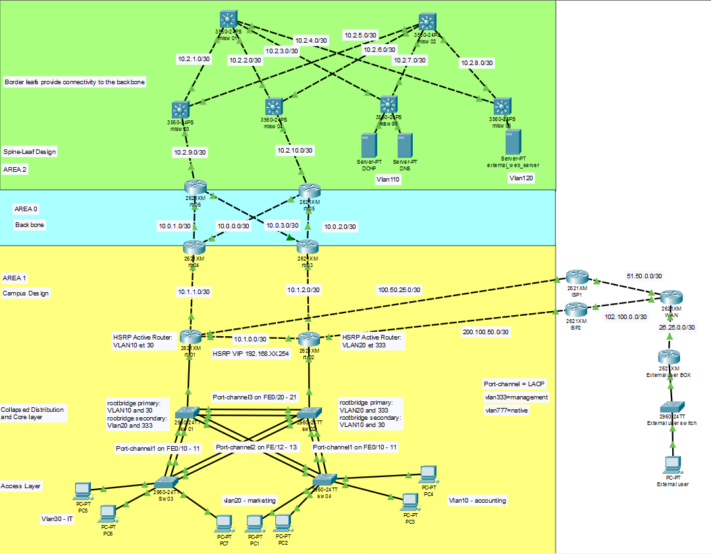
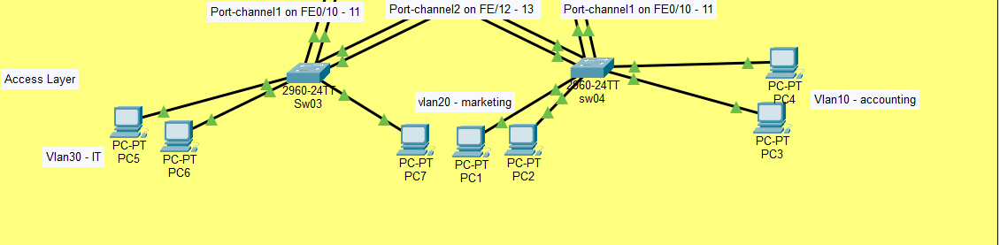
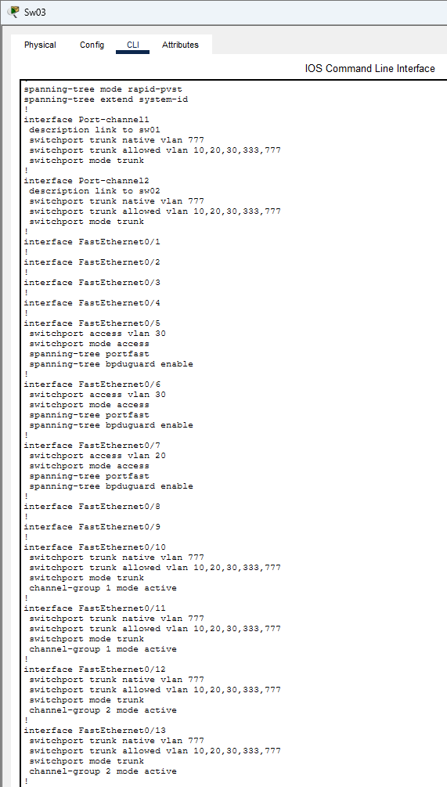
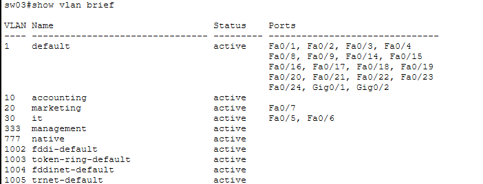
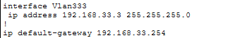
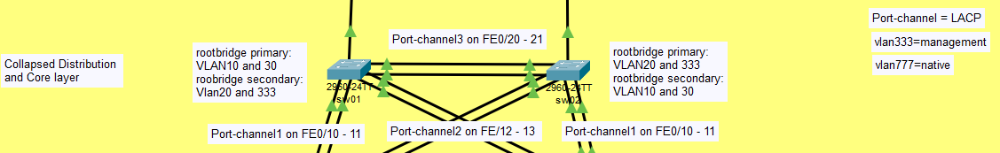
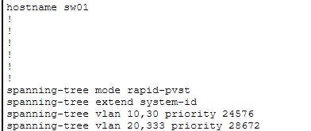
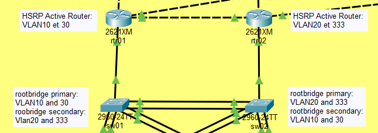
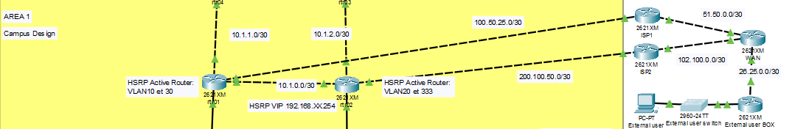
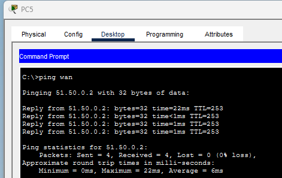

# CCNA Packet Tracer Lab

## Lab Notes

- Routing protocols may require time to converge after startup.
- Ensure hosts are configured as DHCP clients.
- Area 0 and Area 2 documentation will be added soon.

## OVERVIEW



## Technologies Used

- OSPF multi-area
- HSRP
- VLAN segmentation
- EtherChannel (LACP)
- STP (RPVST+)
- Router-on-a-Stick
- Spine–Leaf
- Dual ISP connectivity
- NAT
- DNS
- DHCP

## Topology Description

- **AREA 0**: OSPF backbone  
- **AREA 1**: Traditional campus for users (IT, Marketing, Accounting)  
- **AREA 2**: Spine–Leaf data center with servers  
- Dual ISP connectivity for Internet access  

---

# AREA1

AREA1 is a traditional campus design with:

- Access layer switches  
- Collapsed Core/Distribution layer  
- Router-on-a-Stick architecture  

---

## Access Layer

This layer connects end hosts to the network.



**sw03 configuration:**



---

## EtherChannel

EtherChannel aggregates two or more interfaces into one logical link.  
It provides redundancy and increases available bandwidth.

In this lab, **LACP** is used.

Example:

```bash
enable
configure terminal
interface range fastEthernet 0/10-11
channel-group 1 mode active
```

Configuration must match on both sides.

Useful command:

```bash
show etherchannel summary
```

In this lab:

- Port-channel1 → Fa0/10–11  
- Port-channel2 → Fa0/12–13  

---

## VLAN

VLANs segment broadcast domains and logically group devices.

In this lab:

- VLAN10 → Accounting  
- VLAN20 → Marketing  
- VLAN30 → IT  
- VLAN333 → Management  

Best practice: change native VLAN on trunk ports.

Modes:

- **Access mode** → Assign VLAN to end host  
- **Trunk mode** → Carry multiple VLANs  

Useful command:

```bash
show vlan brief
```



---

## VLAN333 – Management VLAN



VLAN333 is used for network device management.  
Only VLAN30 (IT) can access it.

Example configuration:

```bash
enable
configure terminal
vlan 333
 name management
exit
interface vlan 333
 ip address 192.168.33.3 255.255.255.0
exit
ip default-gateway 192.168.33.1
```

---

## Spanning Tree (Access Layer)

Spanning Tree prevents loops and broadcast storms.

RPVST+ is used because:

- One instance per VLAN  
- Faster convergence  

Example:

```bash
interface FastEthernet0/7
 spanning-tree portfast
 spanning-tree bpduguard enable
```

- **PortFast** → Used on access ports  
- **BPDU Guard** → Shuts port if BPDU is received  

Useful command:

```bash
show spanning-tree
```

---

# Collapsed Distribution and Core Layer

This layer is an aggregation point for access switches and provides redundancy.

No end hosts are connected here.



Core and Distribution layers aren't separated for simplicity (small campus).

---

## Spanning Tree (Core/Distribution)



Spanning Tree elects a **root bridge** which is the reference point used to calculate loop-free paths.
You can define the root bridge as primary and secondary. If the primary root bridge fails, the secondary will take over.

By default:

- Lowest priority wins  
- If equal, lowest MAC address wins  

Example:

```bash
spanning-tree vlan 10 root primary
spanning-tree vlan 20 root secondary
```

In this lab:

- sw01 → Primary for VLAN10 & VLAN30  
- sw02 → Primary for VLAN20 & VLAN333

Best practice:  
Synchronize **Root Bridge** with **Active HSRP Router**.



---

# Distribution Routers (rtr01 & rtr02)



These routers provide:

- Inter-VLAN routing  
- HSRP redundancy  
- NAT  
- OSPF connectivity  

---

## Router-on-a-Stick

Allows routing between VLANs using one physical interface.

Steps:

1. Create subinterface  
2. Assign VLAN with dot1Q  
3. Configure IP address  

Example:

```bash
interface fastEthernet 1/0.10
 encapsulation dot1Q 10
 ip address 192.168.10.1 255.255.255.0
```

Each subinterface acts as default gateway.

---

## HSRP

HSRP provides a virtual default gateway.

- One router is **Active**  
- One router is **Standby**  
- Hosts use a **Virtual IP**  

If the active router fails, standby takes over.

Example (rtr01 active for VLAN10):

```bash
standby 10 ip 192.168.10.254
standby 10 priority 110
standby 10 preempt
```

Notes:

- Default priority = 100  
- Higher priority wins  
- `preempt` allows takeover after recovery  

Useful command:

```bash
show standby
show standby brief
```

---

## OSPF

OSPF is a dynamic routing protocol.

Features:

- Fast convergence  
- Link-state database  
- Supports multi-area design  

Router ID:

- Highest loopback IP (recommended)  

Example:

```bash
interface Loopback0
 ip address 172.31.255.1 255.255.255.255
```

OSPF configuration:

```bash
router ospf 1
 log-adjacency-changes
 passive-interface FastEthernet1/1
 passive-interface Loopback0
 passive-interface FastEthernet1/0.10
 passive-interface FastEthernet1/0.20
 passive-interface FastEthernet1/0.30
 passive-interface FastEthernet1/0.33
 auto-cost reference-bandwidth 100000
 network 192.168.0.0 0.0.255.255 area 1
 network 172.31.255.1 0.0.0.0 area 1
 network 10.1.0.0 0.0.255.255 area 1
 default-information originate
```

Passive-interface:

- Advertises network  
- Does not form adjacency (useful for third-party routers) 

default-information originate: 

- Redistribute default gateway


Useful command:

```bash
show ip ospf interface
show ip ospf neighbor
```

---

## ACL

ACLs control traffic filtering.

Types:

- **Standard ACL** → Filter by source  
- **Extended ACL** → Filter by protocol, source, destination  

In this lab:

- Standard ACL → Used for NAT  
- Extended ACL → Restrict VLAN10 & VLAN20  
- VLAN30 (IT) → Full access  

### NAT ACL

```bash
ip access-list standard nat_vlan
 permit 192.168.10.0 0.0.0.255
 permit 192.168.20.0 0.0.0.255
 permit 192.168.30.0 0.0.0.255
```

### Extended ACL VLAN10

This ACL restricts user traffic from VLAN10.

Security policy:
- No direct access to other user VLANs.
- Access allowed only to specific infrastructure services:
  - DNS server
  - External HTTPS web server
- ICMP allowed for testing.
- IT VLAN (VLAN30) can initiate connections to users.
- All other traffic is denied by default.

```bash
ip access-list extended vlan_10
permit udp any eq bootpc any eq bootps
permit tcp 192.168.10.0 0.0.0.255 host 10.2.120.1 eq 443
permit udp 192.168.10.0 0.0.0.255 host 10.2.110.2 eq domain
permit icmp 192.168.10.0 0.0.0.255 host 10.2.120.1 echo
permit icmp 192.168.10.0 0.0.0.255 host 10.2.110.1 echo
permit icmp 192.168.10.0 0.0.0.255 host 10.2.110.2 echo
deny ip 192.168.10.0 0.0.0.255 host 10.2.120.1
deny ip 192.168.10.0 0.0.0.255 host 10.2.110.1
deny ip 192.168.10.0 0.0.0.255 host 10.2.110.2
permit icmp 192.168.10.0 0.0.0.255 192.168.30.0 0.0.0.255 echo-reply
permit tcp 192.168.10.0 0.0.0.255 192.168.30.0 0.0.0.255 established
deny ip 192.168.10.0 0.0.0.255 192.168.30.0 0.0.0.255
deny ip 192.168.10.0 0.0.0.255 192.168.33.0 0.0.0.255
deny ip 192.168.10.0 0.0.0.255 192.168.20.0 0.0.0.255
permit ip 192.168.10.0 0.0.0.255 any
```


Applied to interface:

```bash
interface FastEthernet1/0.10
 ip access-group vlan_10 in
```

The ACL is applied inbound on the VLAN10 subinterface to filter traffic close to the source.


Useful command:

```bash
show access-lists name/number
```

---

## NAT

NAT translates private IP addresses into public IP addresses.

### Static NAT (HTTPS only)

```bash
ip nat inside source static tcp 10.2.120.1 443 100.50.25.1 443
```

Maps external web server to public IP on port 443.

Test example with external user:


---

## PAT (Overload)

PAT allows multiple internal hosts to share one public IP.

Used for VLAN10, VLAN20 and VLAN30.

```bash
ip nat inside source list nat_vlan interface FastEthernet1/1 overload
```

Test example with PC5:




Useful command:

```bash
show ip nat translations
```
